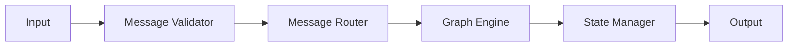
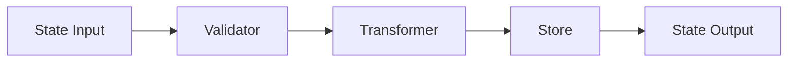

# LangGraph Task 架构设计文档

## 1. 系统架构概述

### 1.1 架构设计原则
- 模块化设计
- 高内聚低耦合
- 可扩展性优先
- 简单性和可维护性

### 1.2 系统层次结构
```
LangGraph Task
├── Core Layer
│   ├── Graph Engine
│   ├── State Management
│   └── Message Processing
├── Integration Layer
│   ├── LangChain Connector
│   ├── LangGraph Integration
│   └── External APIs
└── Application Layer
    ├── CLI Interface
    ├── Visualization
    └── Utilities
```

## 2. 核心模块设计

### 2.1 Graph Engine（图引擎）
- **职责**：管理和执行任务图
- **主要组件**：
  - Graph Builder：构建任务图
  - Node Manager：管理图节点
  - Edge Controller：控制节点间关系
  - Execution Engine：执行图操作

### 2.2 State Management（状态管理）
- **职责**：管理系统状态
- **组件**：
  - State Store：状态存储
  - State Validator：状态验证
  - State Transformer：状态转换

### 2.3 Message Processing（消息处理）
- **职责**：处理系统消息
- **组件**：
  - Message Queue：消息队列
  - Message Validator：消息验证
  - Message Router：消息路由

## 3. 集成层设计

### 3.1 LangChain Connector
- 与 LangChain 框架的集成接口
- 支持各种语言模型的接入
- 提供模型调用和管理功能

### 3.2 LangGraph Integration
- 图结构定义和管理
- 图执行流程控制
- 图可视化支持

### 3.3 External APIs
- REST API 支持
- WebSocket 接口
- 第三方服务集成

## 4. 应用层设计

### 4.1 CLI Interface
- 命令行工具实现
- 参数解析和验证
- 交互式操作支持

### 4.2 Visualization
- 图结构可视化
- 执行过程可视化
- 状态监控界面

### 4.3 Utilities
- 日志管理
- 配置管理
- 错误处理

## 5. 数据流设计

### 5.1 消息流


### 5.2 状态流


## 6. 接口设计

### 6.1 核心接口
```python
class AgentState(TypedDict):
    messages: Sequence[BaseMessage]
    next_step: str | None

def process_message(state: AgentState) -> AgentState:
    ...

def create_agent_graph() -> Graph:
    ...
```

### 6.2 扩展接口
- 自定义节点接口
- 状态处理接口
- 消息处理接口

## 7. 技术选型

### 7.1 核心技术
- **Python 3.12+**：主要开发语言
- **LangChain**：语言模型框架
- **LangGraph**：图处理框架

### 7.2 依赖技术
- **Type Hints**：类型注解
- **AsyncIO**：异步支持
- **Poetry**：依赖管理

### 7.3 开发工具
- **pytest**：测试框架
- **black**：代码格式化
- **mypy**：类型检查

## 8. 部署架构

### 8.1 开发环境
```
Development
├── Poetry Environment
├── Git Version Control
└── Local Development Server
```

### 8.2 测试环境
```
Testing
├── CI/CD Pipeline
├── Test Runners
└── Coverage Reports
```

### 8.3 生产环境
```
Production
├── Package Distribution
├── Container Support
└── Monitoring Tools
```

## 9. 安全设计

### 9.1 数据安全
- 输入验证
- 数据加密
- 访问控制

### 9.2 运行时安全
- 异常处理
- 资源限制
- 日志审计

## 10. 扩展性设计

### 10.1 插件系统
- 插件接口定义
- 插件加载机制
- 插件管理系统

### 10.2 自定义扩展
- 自定义节点
- 自定义状态处理
- 自定义消息处理 