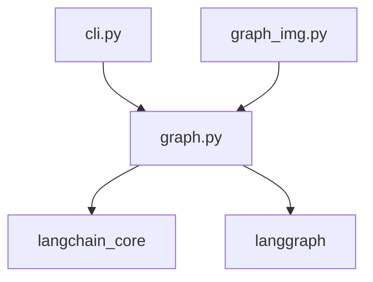

# LangGraph Task 代码实现文档

## 目录结构

```
src/langgraph_task/
├── __init__.py      # 包初始化文件
├── graph.py         # 核心图处理模块
├── graph_img.py     # 图像生成模块
└── cli.py          # 命令行接口模块
```

## 核心模块说明

### 1. 图处理模块 (graph.py)

#### 1.1 AgentState 类型定义

```python
class AgentState(TypedDict):
    """代理状态类型定义"""
    messages: Sequence[BaseMessage]  # 消息序列
    next_step: str | None           # 下一步操作
```

**功能说明**：

- 定义了代理状态的数据结构
- 包含消息历史和下一步操作信息
- 使用 TypedDict 确保类型安全

#### 1.2 消息处理函数

```python
def process_message(state: AgentState) -> AgentState:
    """处理会话中的消息"""
    if not isinstance(state, dict):
        raise ValueError("状态必须是字典类型")
    
    if "messages" not in state:
        raise KeyError("状态字典必须包含'messages'键")
        
    if "next_step" not in state:
        raise KeyError("状态字典必须包含'next_step'键")
        
    if not state["messages"]:
        raise ValueError("消息序列不能为空")
    
    print("Processing message:", state["messages"][-1].content)
    return {"messages": state["messages"], "next_step": None}
```

**功能说明**：

- 验证输入状态的有效性
- 处理消息内容
- 返回更新后的状态
- 包含完整的错误处理

#### 1.3 代理图创建函数

```python
def create_agent_graph() -> Graph:
    """创建代理图"""
    workflow = StateGraph(AgentState)
    workflow.add_node("process", process_message)
    workflow.set_entry_point("process")
    return workflow.compile()
```

**功能说明**：

- 创建新的状态图
- 添加处理节点
- 设置入口点
- 编译并返回可用的图

### 2. 图像生成模块 (graph_img.py)

#### 2.1 图像生成函数

```python
def graph_img(
    graph: Graph, 
    output_file_path: str, 
    draw_method: Optional[MermaidDrawMethod] = None
) -> None:
    """生成流程图并保存为PNG文件"""
    if not graph:
        raise ValueError("Graph object cannot be None")
    if not output_file_path:
        raise ValueError("Output file path cannot be empty")
        
    draw_method = draw_method or MermaidDrawMethod.API
    
    try:
        graph.get_graph().draw_mermaid_png(
            draw_method=draw_method,
            output_file_path=output_file_path
        )
    except Exception as e:
        raise RuntimeError(f"Failed to generate graph image: {str(e)}")
```

**功能说明**：

- 将图结构可视化为PNG图片
- 支持自定义绘图方法
- 包含输入验证
- 提供详细的错误处理

### 3. 命令行接口模块 (cli.py)

#### 3.1 主函数

```python
def main():
    """应用程序入口点"""
    graph = create_agent_graph()
    
    state = {
        "messages": [HumanMessage(content="Hello from CLI!")],
        "next_step": "process"
    }
    
    result = graph.invoke(state)
    print("\nFinal state:", result)
    return 0
```

**功能说明**：

- 创建并初始化代理图
- 设置初始状态
- 执行图处理
- 显示处理结果

## 模块依赖关系



## 关键特性

1. **类型安全**
   - 使用 TypedDict 和类型注解
   - 严格的输入验证
   - 明确的返回类型

2. **错误处理**
   - 详细的错误检查
   - 清晰的错误消息
   - 异常捕获和处理

3. **模块化设计**
   - 职责分离
   - 松耦合架构
   - 可扩展性

4. **可视化支持**
   - 图结构可视化
   - 灵活的输出选项
   - 多种渲染方法

## 使用示例

### 基本使用

```python
from langgraph_task.graph import create_agent_graph
from langchain_core.messages import HumanMessage

# 创建图
graph = create_agent_graph()

# 设置状态
state = {
    "messages": [HumanMessage(content="Hello!")],
    "next_step": "process"
}

# 执行处理
result = graph.invoke(state)
```

### 生成图像

```python
from langgraph_task.graph_img import graph_img

# 生成并保存图像
graph_img(graph, "output.png")
```

## 配置选项

### 图像生成选项

- `draw_method`: 绘图方法选择
  - `MermaidDrawMethod.API`: 使用 Mermaid.ink API（默认）
  - `MermaidDrawMethod.PYPPETEER`: 使用本地 Pyppeteer

## 开发指南

### 添加新功能

1. 在相应模块中添加新函数/类
2. 更新类型定义（如需要）
3. 添加错误处理
4. 更新文档
5. 添加测试用例

### 测试

- 运行单元测试：`pytest tests/`
- 检查覆盖率：`pytest --cov=langgraph_task`

## 注意事项

1. 状态验证
   - 确保状态对象格式正确
   - 检查必要字段存在
   - 验证字段类型

2. 错误处理
   - 捕获所有可能的异常
   - 提供有意义的错误消息
   - 保持状态一致性

3. 性能考虑
   - 大型消息处理
   - 图像生成优化
   - 内存使用控制
